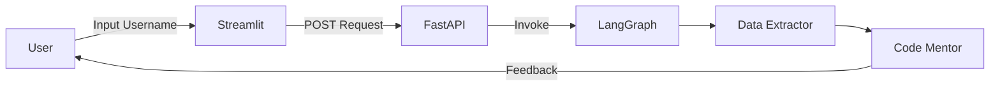

# 🐙 GitHub Profile & Portfolio Reviewer

An agentic AI system designed to analyze GitHub profiles and provide actionable mentor feedback. Built with **LangGraph**, **FastAPI**, and **Streamlit**.

## 🚀 Overview

This project uses an AI agent to fetch real-time data from a user's GitHub profile—including recent repositories and primary languages—and provides a professional review with strengths and suggestions for improvement.

### Key Features:
- **Agentic Workflow**: Managed by LangGraph for structured data extraction and reasoning.
- **AI Brain**: Powered by Groq's Llama-3 model for high-speed, intelligent coding mentorship.
- **FastAPI Backend**: A lightweight and scalable API layer.
- **Streamlit Frontend**: A sleek, user-friendly dashboard for interactive reviews.

---

## 🏗️ Architecture

The system follows a multi-node agentic design:
1. **Data Extractor**: Fetches user bio and repository metadata via GitHub API.
2. **Code Mentor**: Analyzes the data and generates a professional portfolio review.



---

## 🛠️ Setup & Installation

### 1. Clone the Repository
```bash
git clone https://github.com/SatyamKumarCS/GithubProfileReview.git
cd GithubProfileReview
```

### 2. Environment Variables
Create a `.env` file in the root directory:
```env
GROQ_API_KEY=your_groq_api_key
GITHUB_TOKEN=your_optional_github_token
```

### 3. Install Dependencies
```bash
pip install -r requirements.txt
```

---

## 🏃 Running the Application

### Start the Backend
```bash
uvicorn main:app --reload --port 8001
```

### Start the Frontend
```bash
streamlit run ui/app.py
```

Open your browser to `http://localhost:8501` to start reviewing profiles!

---

## 💎 Tech Stack
- **Backend**: FastAPI, LangGraph, Python-dotenv
- **AI/LLM**: Groq (Llama 3.3)
- **Frontend**: Streamlit
- **Data**: GitHub REST API
